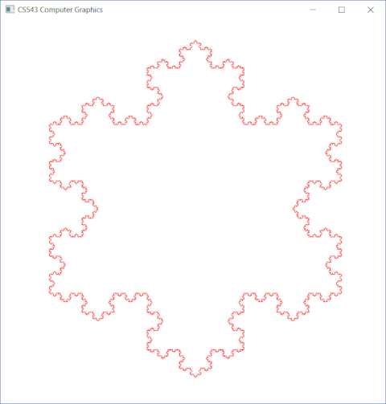
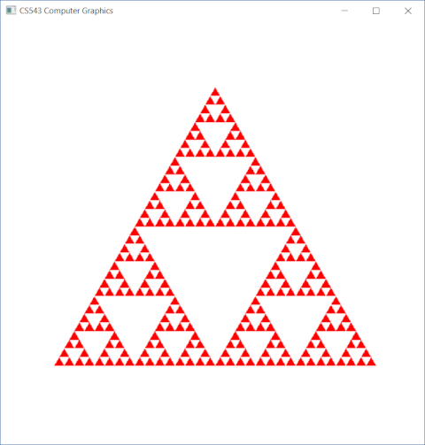
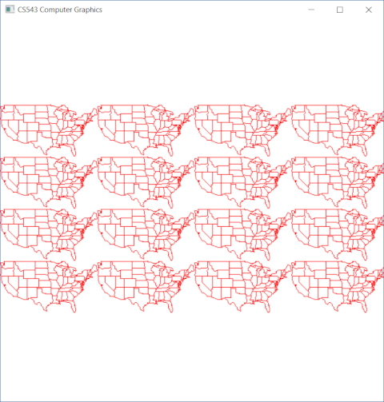

# WPI CS543 Computer Graphics, Spring 2018
## Assignment 1
A simple program displaying a series of images. Use following keys to change image:
* **key S** : Clear window and draw Sierpinski Gasket
* **Key K** : Clear window and draw the Koch snowflake (default is to iterate 3 times). Track the iteration level. You will change it below
* **key I** : Clear window, increase the number of iterations +1 (i.e. if current iteration level is 3, increase it to 4) and draw the Koch snowflake
* **key R** : Clear window, reduce the number of iterations -1 (i.e. if current iteration level is 3, decrease it to 2) and draw the Koch snowflake
* **Key U** : Clear window and draw a 4x4 tiling of USA polyline
* **key D** : Clear window and draw a 4x4 tiling of the dragon polyline
* **key V** : Clear window and draw a 4x4 tiling of the Vinci polyline

DEMO :
| Koch snowflake | Sierpinski Gasket | Tiling US Map |
|:---:|:---:|:---:|
|  |  |  |
